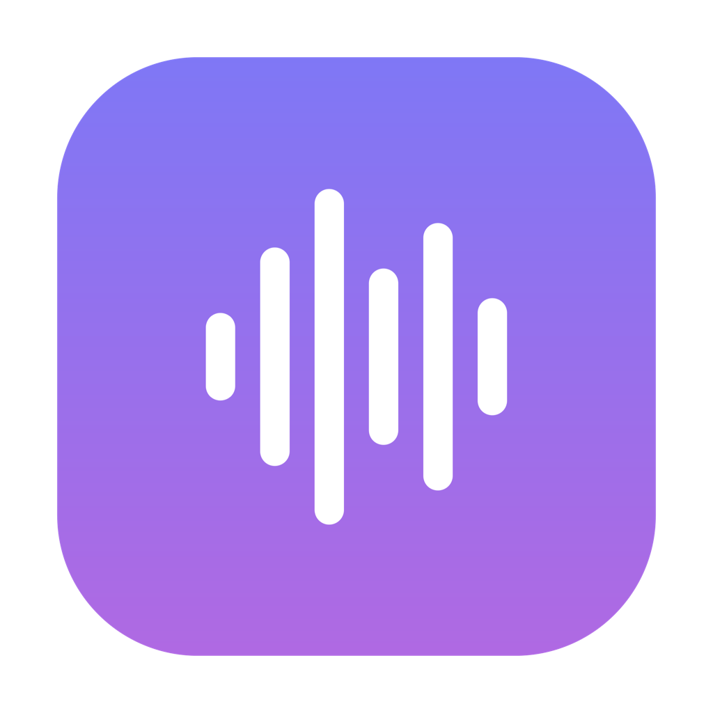
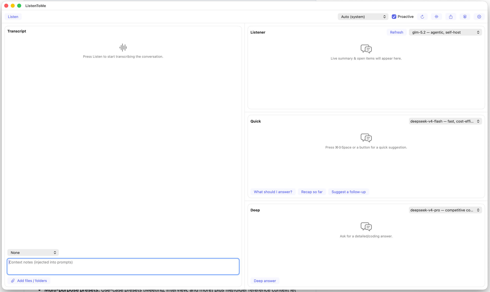

<div align="center">



# ListenToMe

**The free, open-source, fully on-device meeting copilot for macOS — bring your own model, stay private, shape it to any conversation.**

[](https://github.com/tomqwu/ListenToMe/actions/workflows/ci.yml)


[](LICENSE)


</div>

ListenToMe listens to your mic and the other participants' system audio, transcribes live, and gives
real-time AI help — all on your Mac. It runs transcription on-device with Apple's SpeechAnalyzer and
routes AI inference through [Ollama](https://ollama.com), so with a local model **your audio and
transcript never leave the machine**.

## Screenshot



## Why ListenToMe

- **On-device & private.** Transcription runs locally via Apple SpeechAnalyzer, and AI help can run
  entirely against a local Ollama model — audio and transcript need never leave your Mac.
- **Bring your own model.** Pick any Ollama model, local or cloud, instead of being locked to a
  single undisclosed backend LLM.
- **Multi-pane, multi-model.** Four panes, and each AI pane has its own model dropdown — run a fast
  model for live notes and a stronger one for deep analysis, side by side, in the same conversation.
- **Multi-purpose presets.** Use-case presets (Meeting, Interview, and more) plus file/folder
  reference context let one app serve meetings, interviews, study, support, and beyond.
- **Free & open-source.** No subscription, no seat pricing, no closed pipeline — the code is open
  for inspection.

## How it compares

Distilled from [`docs/competition-analysis.md`](docs/competition-analysis.md); facts are stated as of
2026 and qualified where they couldn't be confirmed from a primary source.

| Tool | On-device | BYO model | Multi-pane | Presets | Price |
|---|---|---|---|---|---|
| **ListenToMe** | Yes — transcription + local AI | Yes — Ollama local + cloud | Yes — per-pane model | Yes | Free & open-source |
| Granola | No — local capture, cloud ASR + AI | Reported, unconfirmed | No | Templates (29+) | Free; ~$14–35/user/mo |
| Otter.ai | No — cloud | No | No | Limited | Free; ~$8–30/user/mo |
| Fireflies.ai | No — cloud | No (export via MCP) | No | Limited | Free; ~$10–39/seat/mo |
| Cluely | No — cloud | No / undisclosed | No | No | Free; $19.99–149.99/mo |
| MacWhisper | Yes — on-device by default | Yes — BYO keys (Gumroad) | No | Prompts | Free; ~$69 one-time / subs |

## Features

**Live capture & transcription**
- Dual-channel capture: your mic + the other participants' system audio, source-labeled.
- On-device transcription via **Apple SpeechAnalyzer** (default) or the legacy **SpeechRecognizer**.
- **Transcription-language** picker (English, Mandarin, and more) and **audio-file import** to
  transcribe an existing recording.

**Four-pane AI copilot**
- **Transcript** — live, source-labeled, no model.
- **Listener** — rolling summary plus open questions / action items.
- **Quick** — fast suggestions on the global hotkey, buttons, or proactively when someone asks a
  question.
- **Deep** — on-demand, detailed long-reasoning answers.
- Listener context is shared into Quick and Deep so on-demand answers stay grounded in the meeting.

**Bring-your-own-model**
- Each AI pane has its **own model dropdown** with "good for" hints, listing chat-capable models
  discovered from your Ollama server — local and Ollama-cloud (`:cloud`) models alike.
- **AI response-language** setting, independent of the transcription language.

**Make it yours**
- **Use-case presets** (Meeting, Interview, etc.) tune the copilot's behavior.
- **File & folder reference context** with a configurable token budget.
- **Markdown session export** for sharing or review.
- **First-run onboarding** and a global **⌘⇧Space** hotkey for instant suggestions.

## Requirements

- **macOS 26+**
- [Ollama](https://ollama.com) — running locally for local models, and/or an Ollama Cloud API key
  for cloud models. The app auto-picks an installed model on first launch.
- To build from source: Xcode 26+, `brew install xcodegen` (optionally `swiftlint`, `xcbeautify`).

## Install

**Download (recommended)**
- Grab the notarized `.dmg` from [Releases](https://github.com/tomqwu/ListenToMe/releases),
  open it, and drag **ListenToMe** to **Applications**.
  _(Available once v1.0 is published.)_

**Build from source**
```bash
brew install xcodegen
make run
```

## Build & run

```bash
make test     # run the ListenToMeCore test suite (unit + integration)
make build    # generate the Xcode project and build the app
make run      # build and launch
make pre-push # lint + tests + build (the CI-equivalent gate)
```

Optional: copy `signing.local.mk.example` to `signing.local.mk` (gitignored) and set your
code-signing identity so granted macOS permissions (mic/screen/accessibility) persist across
rebuilds (otherwise each rebuild re-asks). Find it via `security find-identity -v -p codesigning`.

On first run, grant Microphone, Speech Recognition, Screen Recording (for system audio), and
Accessibility (for the global hotkey) in System Settings → Privacy & Security. The app shows a
Permissions panel on launch (also reachable from the toolbar 🛡️) to grant these up front.

## Models, presets & languages

- **Per-pane models.** Each of Listener, Quick, and Deep has a model dropdown in its header with
  "good for" hints. Choices persist across launches; the toolbar **↻** button re-scans installed
  models (e.g. after `ollama pull`). On first launch any role whose saved model isn't installed
  auto-switches to one that works — no manual config needed.
- **Ollama Cloud.** Paste your Ollama API key (from [ollama.com](https://ollama.com)) in
  **Settings** to use cloud models (e.g. `deepseek-v4-flash`, `qwen3-coder`). With a key set, the
  app routes discovery and inference to `https://ollama.com`; leave it blank to use local Ollama at
  `http://localhost:11434`. The key is stored in your macOS Keychain.
- **Presets.** Pick a use-case preset to tailor how the copilot responds.
- **Languages.** Independent **transcription-language** and **AI response-language** pickers.
- **Reference files.** Add files/folders as context, with a configurable token budget.
- **Audio import.** Import an audio file to transcribe it.
- **Export.** Save the session as Markdown (toolbar ⬆️).

## Privacy

- **On-device transcription.** Speech-to-text runs locally via Apple SpeechAnalyzer (or
  SpeechRecognizer) — both on-device.
- **Local models never leave the Mac.** If you use a local Ollama model, audio and transcript stay
  entirely on your machine.
- **Cloud only when you choose it.** A cloud (`:cloud`) model is used only if you explicitly select
  one and set an Ollama API key; in that case the transcript/prompt is sent to Ollama Cloud and
  nowhere else.

## Architecture

- **`ListenToMeCore`** (Swift package): all testable logic — conversation state, VAD, question
  detection, prompt building, Ollama provider, model router, context engine, `MeetingSession`.
- **`App/`**: macOS glue — `DualChannelCapture`, `SpeechRecognizerTranscriber`, SwiftUI UI, hotkey.

See [`docs/superpowers/specs/2026-06-18-listentome-design.md`](docs/superpowers/specs/2026-06-18-listentome-design.md)
for the full design and
[`docs/superpowers/plans/2026-06-18-listentome-mvp.md`](docs/superpowers/plans/2026-06-18-listentome-mvp.md)
for the implementation plan.

### CI

GitHub Actions ([`.github/workflows/ci.yml`](.github/workflows/ci.yml)) gates every PR to `main` on a
macOS runner: SwiftLint, the full `ListenToMeCore` test suite (unit + headless integration/e2e), and
a **coverage floor of 95%** enforced by `scripts/check-coverage.sh`. Because the app target deploys to
macOS 26 and uses ScreenCaptureKit/Speech, the **app build and GUI/audio e2e cannot run on hosted
runners** — those are verified locally via [`docs/manual-smoke-test.md`](docs/manual-smoke-test.md).

`make e2e` runs the checks CI can't (it needs a real Mac + Ollama): it builds the app target,
verifies `make run`'s app-path resolution, and runs a real LLM contract test against your local
Ollama through the actual `OllamaProvider`, auto-selecting an installed chat model (override with
`LTM_E2E_MODEL=...`). Mic/system-audio capture and live speech-to-text remain manual — see
[`docs/manual-smoke-test.md`](docs/manual-smoke-test.md).

## Known limitations

- **Transcription engine (Settings):** the default **SpeechAnalyzer** (macOS 26) transcribes both
  channels concurrently. The legacy **SpeechRecognizer** option uses one `SFSpeechRecognizer` per
  source and may hit a process-global active-recognition limit (`kAFAssistantErrorDomain 1100`) on
  some systems. SpeechAnalyzer downloads its language model on first use. Both are on-device.
- A short utterance spoken entirely within the brief recognizer-finalization gap may merge into the
  next finalized segment.
- **Ollama-only by design.** Ollama Cloud already exposes GPT/DeepSeek/Qwen/etc. through one key, so
  dedicated Claude/OpenAI providers are intentionally not planned.
- **WhisperKit engine (opt-in):** an opt-in third transcription engine for true multilingual
  code-switching (e.g. Mandarin↔English mid-sentence) that Apple's on-device Speech can't do. It
  downloads a model on first use, emits finalized segments only (no live partials), and its
  dual-channel finals may occasionally interleave out of chronological order.
- **Cross-launch session history (deferred):** Markdown export covers sharing/review; live sessions
  are otherwise ephemeral.

## Contributing

PRs welcome. Before pushing, run the CI-equivalent gate:

```bash
make pre-push
```

**Releasing.** Maintainers build the signed + notarized `.dmg` locally with `make release` —
see [`docs/RELEASING.md`](docs/RELEASING.md) for prerequisites, the env vars it reads, and the
publish step.

## License

[MIT](LICENSE) © 2026 Tom Wu
