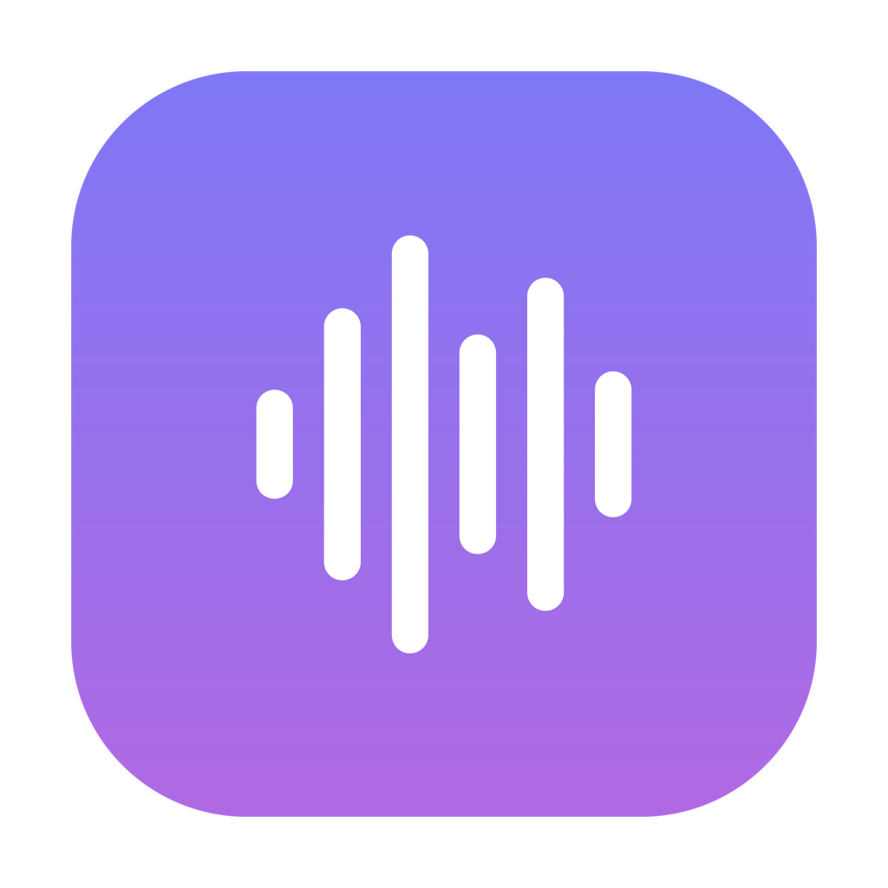
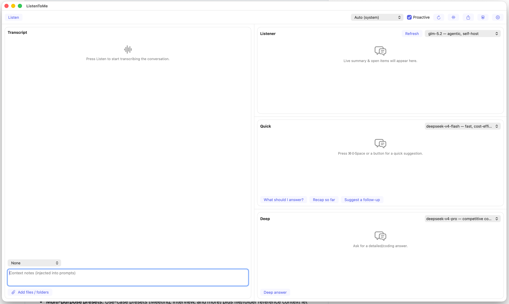

<div align="center">



# ListenToMe

**The free, open-source, fully on-device meeting copilot for macOS and iOS — bring your own model, stay private, shape it to any conversation.**

[](https://github.com/tomqwu/ListenToMe/actions/workflows/ci.yml)


[](LICENSE)


</div>

ListenToMe listens to your mic and the other participants' system audio, transcribes live, and gives
real-time AI help — all on your Mac. It runs transcription on-device with Apple's SpeechAnalyzer and
routes AI inference through [Ollama](https://ollama.com), so with a local model **your audio and
transcript never leave the machine**.

## iPhone and iPad

A native standalone iOS 26 app is now available in source as the **ListenToMeIOS** target.
It includes microphone transcription, a unified live transcript/Quick Summary/Deep Summary dashboard,
local conversations with keyword search, photo/file attachments, Apple Notes share imports and
Markdown sharing. Choose
on-device Apple Intelligence — the default on capable devices — or Ollama: Ollama Cloud with your own
key, or an Ollama server you run on your own network. It does not capture other apps' audio or sync
with the Mac. See [iOS setup, validation and distribution](docs/IOS.md).

```sh
make ios-build
make ios-test
```

## Screenshot



## Why ListenToMe

- **On-device & private.** Transcription runs locally via Apple SpeechAnalyzer, and AI help can run
  entirely against a local Ollama model — audio and transcript need never leave your Mac.
- **Bring your own model.** Pick any Ollama model, local or cloud, instead of being locked to a
  single undisclosed backend LLM.
- **Multi-pane, multi-model.** Four panes, and each AI pane runs its own model — picked from the
  left status rail — run a fast model for live notes and a stronger one for deep analysis, side by
  side, in the same conversation.
- **Multi-purpose presets.** Use-case presets (Meeting, Interview, and more) plus file/folder
  reference context let one app serve meetings, interviews, study, support, and beyond.
- **Free & open-source.** No subscription, no seat pricing, no closed pipeline — the code is open
  for inspection.

## How it compares

Distilled from [`docs/competition-analysis.md`](docs/competition-analysis.md); facts are stated as of
2026 and qualified where they couldn't be confirmed from a primary source.

| Tool | On-device | BYO model | Multi-pane | Presets | Price |
|---|---|---|---|---|---|
| **ListenToMe** | Yes — transcription + local AI | Yes — Ollama local + cloud | Yes — per-pane model | Yes | Free & open-source |
| Granola | No — local capture, cloud ASR + AI | Reported, unconfirmed | No | Templates (29+) | Free; ~$14–35/user/mo |
| Otter.ai | No — cloud | No | No | Limited | Free; ~$8–30/user/mo |
| Fireflies.ai | No — cloud | No (export via MCP) | No | Limited | Free; ~$10–39/seat/mo |
| Cluely | No — cloud | No / undisclosed | No | No | Free; $19.99–149.99/mo |
| MacWhisper | Yes — on-device by default | Yes — BYO keys (Gumroad) | No | Prompts | Free; ~$69 one-time / subs |
| Natively (OSS) | Yes — STT on-device; AI local or cloud | Yes — Gemini, OpenAI, Claude, Groq, Ollama | No | No | Free personal; paid Pro |
| Hyprnote (OSS, now Anarlog) | Partial — on-device STT option; AI local or cloud | Yes — Ollama, LM Studio, OpenRouter | No | No | Free (MIT); paid enterprise |
| Meetily (OSS) | Yes — local by default; cloud LLMs optional | Yes — Ollama local, or cloud APIs | No | No | Free (MIT); paid Pro/Enterprise |

## Features

**Live capture & transcription**
- Dual-channel capture: your mic + the other participants' system audio, source-labeled.
- On-device transcription via **Apple SpeechAnalyzer** (default) or the legacy **SpeechRecognizer**.
- **Transcription-language** picker (English, Mandarin, and more) and **audio-file import** to
  transcribe an existing recording.
- **Survives device changes:** connecting AirPods, docking/undocking or sleep/wake re-installs the
  microphone tap and restarts capture in place ("Mic: input changed — resumed"); a stopped
  system-audio stream gets the same one-shot restart. If a channel really cannot be recovered, the
  capture line turns red with ⚠️ instead of leaving a dead channel under a running timer.
- **No silent recordings:** Listen checks microphone authorization first. If access is denied (or
  restricted by device management), the app explains it and offers **Open Settings** rather than
  reporting "Mic: active" while recording silence.

**Four-pane AI copilot**
- **Transcript** — live, source-labeled, no model.
- **Listener** — rolling summary plus open questions / action items.
- **Quick** — fast suggestions on the global hotkey, buttons, or proactively when someone asks a
  question.
- **Deep** — on-demand, detailed long-reasoning answers.
- Listener context is shared into Quick and Deep so on-demand answers stay grounded in the meeting.
- **Auto** writes Quick, Listener and Deep automatically while you listen, from the same
  speaker-labeled transcript and under the same settings as a manual Generate: your AI
  response-language and the selected use-case preset. Attached reference files reach automatic
  Deep only, matching manual Deep; automatic Quick and Listener get none. Auto output cannot flip
  the pane's language or drop your persona.
- An answer you asked for in Quick ("Draft reply", "Key terms"…) stays on screen: the automatic
  recap keeps updating behind it and **Show recap** switches back. Typing in Notes never cancels a
  running automatic review, and a review that exceeds its deadline says so instead of repeating the
  same request — the deadline scales with the conversation's length and is exactly twice as long for
  Deep. A dropped or stalled connection is still retried normally.

**Bring-your-own-model**
- Each AI pane's model is set from a **model picker in the left status rail**, listing chat-capable
  models discovered from your Ollama server — local and Ollama-cloud (`:cloud`) models alike.
- **AI response-language** setting, independent of the transcription language.

**Make it yours**
- **Use-case presets** (Meeting, Interview, etc.) tune the copilot's behavior.
- **File & folder reference context** with a configurable token budget.
- **Markdown session export** for sharing or review.
- **First-run onboarding** and a global **⌘⇧Space** hotkey for instant suggestions.

## Requirements

- **macOS 26+**
- [Ollama](https://ollama.com) — running locally for local models, and/or an Ollama Cloud API key
  for cloud models. The app auto-picks an installed model on first launch.
- To build from source: Xcode 26+, `brew install xcodegen` (optionally `swiftlint`, `xcbeautify`).

## Install

**Download (recommended)**
- Grab the notarized `.dmg` from [Releases](https://github.com/tomqwu/ListenToMe/releases),
  open it, and drag **ListenToMe** to **Applications**. See [`CHANGELOG.md`](CHANGELOG.md) for
  what changed in recent macOS and iOS releases.

**Build from source**
```bash
brew install xcodegen
make run
```

## Build & run

```bash
make test     # run the ListenToMeCore test suite (unit + integration)
make build    # generate the Xcode project and build the app
make run      # build and launch
make pre-push # lint + tests + build (the CI-equivalent gate)
```

Optional: copy `signing.local.mk.example` to `signing.local.mk` (gitignored) and set your
code-signing identity so granted macOS permissions (mic/screen/accessibility) persist across
rebuilds (otherwise each rebuild re-asks). Find it via `security find-identity -v -p codesigning`.

On first run, grant Microphone, Speech Recognition, Screen Recording (for system audio), and
Accessibility (for the global hotkey) in System Settings → Privacy & Security. The app shows an
onboarding sheet on first launch; grant these permissions from **More → Permissions…** at any time
after that. Microphone access is also re-checked every time you press **Listen**: without it macOS
hands the app silence rather than an error, so the app refuses to start and points you at the
Microphone pane (a managed/restricted Mac gets the explanation without the Settings shortcut).

### Dev builds are a separate app

Debug builds use bundle id `com.tomwu.ListenToMe.dev` and appear as **ListenToMe (Dev)**; the
released dmg uses `com.tomwu.ListenToMe`. macOS keys permission grants by bundle id *and*
code-signing requirement, and the two are signed with different certificates (Apple Development vs
Developer ID), so a shared bundle id would make each install silently invalidate the other's
grants. With separate ids they get their own rows in System Settings → Privacy & Security and can
be installed side by side — you grant permissions once per app.

The Ollama API key stays shared: `KeychainStore` uses a fixed service name, so you paste the key
once. macOS asks each binary for keychain access the first time it reads the item — choose
**Always Allow**.

## Models, presets & languages

- **Per-pane models.** Each of Summary, Quick, and Deep has a model picker in the left status
  rail; the pane header shows the currently selected model as read-only text. Choices persist
  across launches; **More → Refresh models** re-scans installed models (e.g. after `ollama pull`).
  On first launch any role whose saved model isn't installed auto-switches to one that works — no
  manual config needed.
- **AI processing mode.** In **Settings**, explicitly choose **Local only**, **Apple Intelligence**,
  **Cloud**, or **AI off**.
  Local mode verifies downloaded-model metadata before every request and rejects remote/cloud-backed
  models and redirects. Apple Intelligence runs entirely on this device; because its on-device model
  has a small context window, every prompt is capped at 8,000 characters — long meetings are answered
  from the most recent speech and the status line says when material was trimmed. Cloud mode uses
  `https://ollama.com` and the key stored in macOS Keychain.
  It sends transcript, notes, summary and attached reference context to Ollama Cloud. Adding a key
  alone does not switch modes. AI off leaves capture, transcription and saving available.
  When Ollama refuses a request, the pane shows the server's own explanation with its HTTP status —
  a rejected API key and an exhausted quota read as such, not as a missing local model.
- **Presets.** Pick a use-case preset to tailor how the copilot responds.
- **Languages.** Independent **transcription-language** and **AI response-language** pickers.
- **Reference files.** Add files/folders as context, with a configurable token budget. `.rtf` is read
  as its text (never `\rtf1` markup), and non-UTF-8 files (Windows-1252, UTF-16 exports) are decoded
  instead of dropped. Anything that still cannot be included is listed next to the attachments as
  "Not included", with the reason — a file the model never saw is never invisible.
- **Audio import.** Import an audio file to transcribe it.
- **Save conversation (⌘S).** Saves finalized transcript, speaker names, notes and available AI outputs
  without stopping capture. A visible saved time acknowledges success. Failed saves offer Retry / Save As.
- **New conversation (⌘N).** Finishes and saves the current conversation, then clears transcript,
  AI context, notes, names and attached references. Model/language/appearance preferences remain.
- **History (⌘F).** Search saved conversations, open their full contents, and copy/export Markdown.
  Search is case-, accent- and width-insensitive ("cafe" finds "café", "ai" finds "ＡＩ"), splits the
  query on any whitespace including tabs, ranks whole-word matches above matches inside longer words,
  and covers title, summary, notes and the transcript's own words (not the "You:"/"Others:" prefixes).
- **Export (⌘E).** Export the current conversation as Markdown; PDF and recap are also in Export.
  With autosaving off, Save opens Save As and New/Close offers Save As, Cancel or explicit discard.

Autosaving checkpoints finalized text as it changes and available outputs once per second. Current
partial speech is not acknowledged as saved. An interrupted session is available in History through
its last successful checkpoint. Release history lives in `~/Library/Application Support/ListenToMe/Conversations`;
Debug uses `ListenToMe Dev/Conversations`. Legacy `sessions.json` imports once and remains for rollback
until **Clear history** deletes it in the Release app. Turning autosaving off keeps existing history.
A single damaged conversation file no longer hides the rest: it is renamed to
`<id>.json.corrupt-<timestamp>` (never deleted), the remaining conversations still list, and History
shows a one-line note saying what was set aside. An unreadable legacy `sessions.json` is set aside the
same way, so saving, autosave checkpoints and **Clear history** keep working instead of failing forever.
History is local, unencrypted JSON and currently reopens for reading/export, not editing or resuming.

### Automatic speaker identification (experimental)

In Settings, enable **Automatic speaker identification** and choose **WhisperKit** before
pressing Listen. The app analyzes captured system audio on-device about every 20 seconds
(longer when analysis takes more time), and runs a final pass after Stop. The first use downloads
speaker models. Open **Speakers / edit names** to name voices, for example Speaker 1 → Alice.

Names appear in transcript lines and flow into subsequent AI prompts, refreshed listener summaries,
saved-session search, and Markdown/PDF exports. Saving a name clears older Quick/Deep answers;
request them again to use the new name. Speaker identities are matched across analysis passes by
shared audio timing. Ambiguous splits or merges may receive new labels instead of inheriting an
incorrect name. Labels and names are scoped to each recording run; starting another run preserves
older transcript labels but does not recognize people from past runs.

Enable **Identify people sharing my microphone** to also separate voices on the microphone channel.
The two audio channels are analyzed independently; the same person heard on both is not automatically
merged. Without this option, microphone speech remains **You**. SpeechAnalyzer and SpeechRecognizer
support the voice breakdown only; per-line attribution requires WhisperKit timestamps.

This is delayed, periodic identification, with one speaker assigned per transcript line. Overlapping
speech can be misattributed. Analysis covers the first approximately two hours of each enabled channel.
Imported audio files do not use this live-capture speaker analysis. Audio is buffered in memory for
analysis; speaker names are included in saved transcript text when session saving is enabled.

## Privacy

- **On-device transcription.** Speech-to-text runs locally via Apple SpeechAnalyzer (or
  SpeechRecognizer) — both on-device.
- **Local-only AI.** The app accepts only models whose local Ollama metadata identifies downloaded
  weights without a remote destination. Unknown routing is rejected, including cloud model aliases
  served through a local daemon. This trusts the installed local Ollama service and its metadata.
- **Explicit cloud choice.** Select Cloud in Settings to send AI prompt context to Ollama Cloud.
  Audio transcription and experimental speaker processing remain on-device; their models may download
  on first use. Select AI off to stop model requests while continuing to capture and save.
- **One-time model downloads, and which hosts they touch.** In Local-only mode the app otherwise
  contacts only `localhost:11434` (your Ollama daemon). The WhisperKit transcription engine and the
  FluidAudio speaker-identification models are fetched from `huggingface.co` the first time you
  enable them; Apple SpeechAnalyzer/SpeechRecognizer download their on-device language assets from
  Apple's own asset servers the first time you use them. None of these downloads carry audio,
  transcript, or key material — they fetch model weights only.
- **Sandbox and permissions.** The macOS app is **not sandboxed**
  (`com.apple.security.app-sandbox` is `false` in `App/ListenToMe.entitlements`), so it has
  unrestricted user-level file and network access rather than the narrower access a sandboxed app
  would be limited to. This is so file/folder reference context can read arbitrary paths you attach
  without security-scoped bookmarks. It still asks macOS for the Microphone, Speech Recognition,
  Screen Recording, and Accessibility permissions listed above, and only uses them for the features
  described in this README.
- **iOS storage and backup.** Conversations, attachments and queued share imports are written with
  iOS data protection (readable only after the device has been unlocked once since a restart). They
  are included in the device's normal iCloud/Finder backup by default, so a restored phone keeps
  them; **Settings → Privacy → Exclude conversations from iCloud backup** keeps them off any backup.
  Model catalogs are fetched only from a destination you configured — never anonymously.
- **iOS privacy policy and support.** The App Store pages are checked in and linked from the app in
  **More → Settings → Privacy**: [privacy policy](docs/ios-privacy.md) and
  [support](docs/ios-support.md).

## Architecture

- **`ListenToMeCore`** (Swift package): all testable logic — conversation state, VAD, question
  detection, prompt building, Ollama provider, model router, context engine, `MeetingSession`.
- **`iOS/`**: iPhone/iPad SwiftUI app, foreground microphone capture with SpeechAnalyzer, optional Foundation Models summaries.
- **`App/`**: macOS glue — `DualChannelCapture`, `SpeechRecognizerTranscriber`, SwiftUI UI, hotkey.

See [`docs/reviews/2026-09-10/design-and-gap-review.md`](docs/reviews/2026-09-10/design-and-gap-review.md)
for the current architecture and gap review. The original
[`docs/superpowers/specs/2026-06-18-listentome-design.md`](docs/superpowers/specs/2026-06-18-listentome-design.md)
and [`docs/superpowers/plans/2026-06-18-listentome-mvp.md`](docs/superpowers/plans/2026-06-18-listentome-mvp.md)
are historical: the June MVP spec/plan predate Save/New/History, presets, speaker diarization,
explicit AI processing modes, and the iOS app.

### CI

GitHub Actions ([`.github/workflows/ci.yml`](.github/workflows/ci.yml)) runs checks for PRs to `main` on
`macos-26` runners: both app targets compile with the checked-in dependency lock, and the full
`ListenToMeCore` test suite (unit + headless integration/e2e) runs with a **coverage floor of 95%**
enforced by `scripts/check-coverage.sh`. SwiftLint, iOS simulator UI tests, GUI/audio acceptance, and
distribution checks require local validation via [`docs/manual-smoke-test.md`](docs/manual-smoke-test.md).

`make e2e` runs the checks CI can't (it needs a real Mac + Ollama): it builds the app target,
verifies `make run`'s app-path resolution, and runs a real LLM contract test against your local
Ollama through the actual `OllamaProvider`, auto-selecting an installed chat model (override with
`LTM_E2E_MODEL=...`). Mic/system-audio capture and live speech-to-text remain manual — see
[`docs/manual-smoke-test.md`](docs/manual-smoke-test.md).

## Known limitations

- **Transcription engine (Settings):** the default **SpeechAnalyzer** (macOS 26) transcribes both
  channels concurrently. The legacy **SpeechRecognizer** option uses one `SFSpeechRecognizer` per
  source and may hit a process-global active-recognition limit (`kAFAssistantErrorDomain 1100`) on
  some systems. SpeechAnalyzer downloads its language model on first use. Both are on-device.
- **First run downloads the speech model before listening starts.** Pressing Listen the first time
  shows "Transcription: preparing on-device speech model…" and capture only starts once the model is
  ready, so nothing said afterwards is lost. The download can take several minutes on a slow
  connection; Stop, New conversation, closing the window and Cmd-Q all cancel it immediately.
- A short utterance spoken entirely within the brief recognizer-finalization gap may merge into the
  next finalized segment.
- **Ollama and Apple Intelligence today.** Ollama Cloud already exposes GPT/DeepSeek/Qwen/etc.
  through one key, and Apple Intelligence covers on-device inference without Ollama. Dedicated
  OpenAI-compatible endpoint support (LM Studio, OpenRouter, vLLM) is tracked in
  [#52](https://github.com/tomqwu/ListenToMe/issues/52) and not yet implemented.
- **WhisperKit engine (opt-in):** an opt-in third transcription engine for true multilingual
  code-switching (e.g. Mandarin↔English mid-sentence) that Apple's on-device Speech can't do. It
  downloads a model on first use (before capture starts, same as above), emits finalized segments
  only (no live partials), and its
  dual-channel finals may occasionally interleave out of chronological order.

## Contributing

PRs welcome. Before pushing, run the CI-equivalent gate:

```bash
make pre-push
```

**Releasing.** Maintainers build the signed + notarized `.dmg` locally with `make release` —
see [`docs/RELEASING.md`](docs/RELEASING.md) for prerequisites, the env vars it reads, and the
publish step.

## License

[MIT](LICENSE) © 2026 Tom Wu
